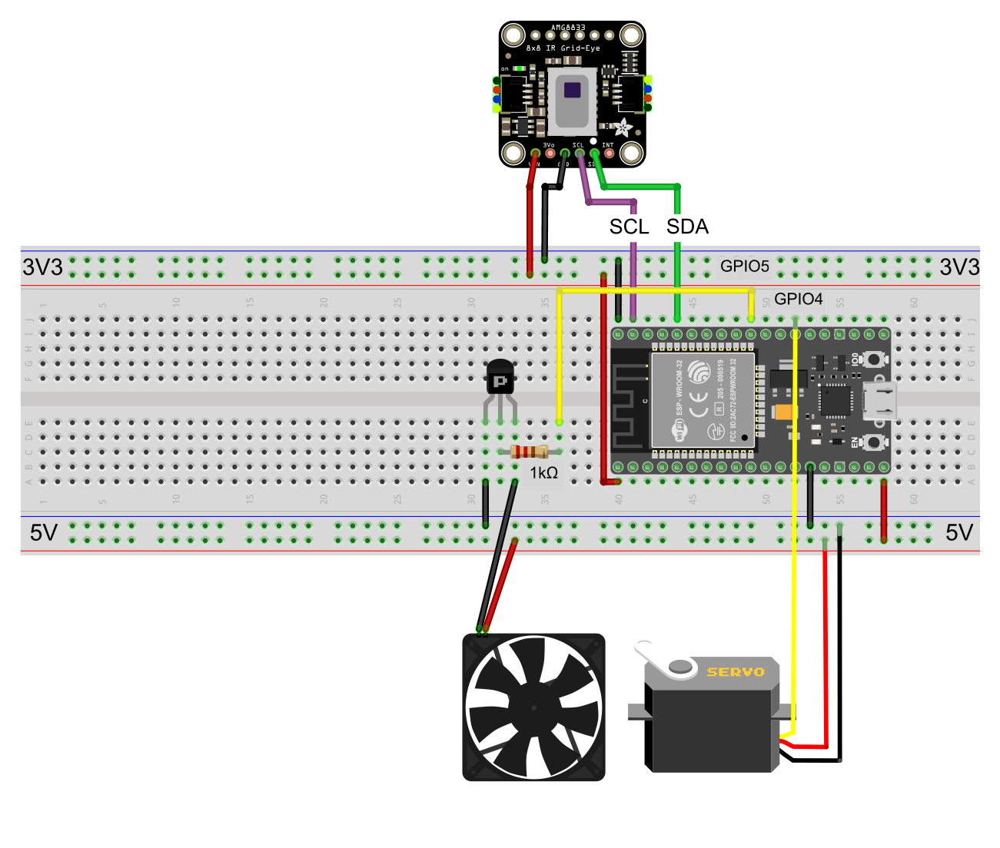

# Smart fan

_Smart fan_ is a small project written for my Embedded Systems exam.

The project is based on [Zephyr RTOS](https://www.zephyrproject.org/) and consists of a fan that is oriented to cool the hottest part of the room. The amg8833 sensor measure the room temperature with a resolution of 8x8 pixels, when the hottest pixel is not in the middle, the servomotor on which the fan is mounted will orient towards the hottest point. Furthermore, the fan speed adapts according to the temperature detected.

The project is compatible with ESP32 boards, but it can be easily ported to other boards supported by Zephyr.

### Hardware

- 1× ESP32 board
- 1× amg8833 thermal camera
- 1× Servo motor
- 1× 5V fan
- 1× PNP transitor
- 1× 1kΩ resistor

### Wiring



### Installation

First, follow the [Zephyr installation guide](https://docs.zephyrproject.org/latest/getting_started/index.html) to install West, Zephyr SDK and their dependencies.

Then clone this repository and install the required modules:
```bash
git clone https://github.com/bortoz/smart-fan.git
cd smart-fan
west init .
west update
```

### Building

```bash
west build app
```

### Flashing

```bash
west flash
```

### Serial monitor

```bash
west espressif monitor
```
